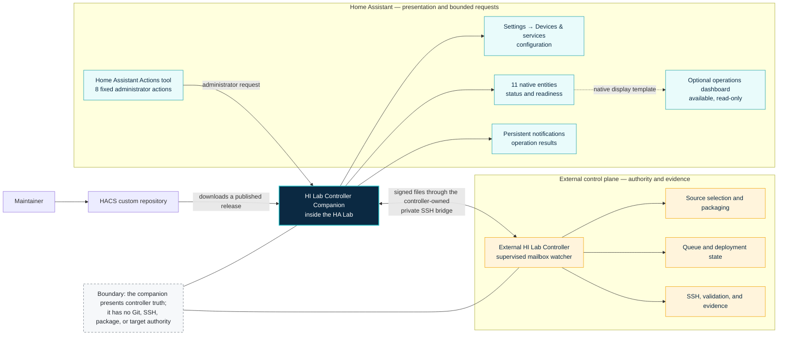
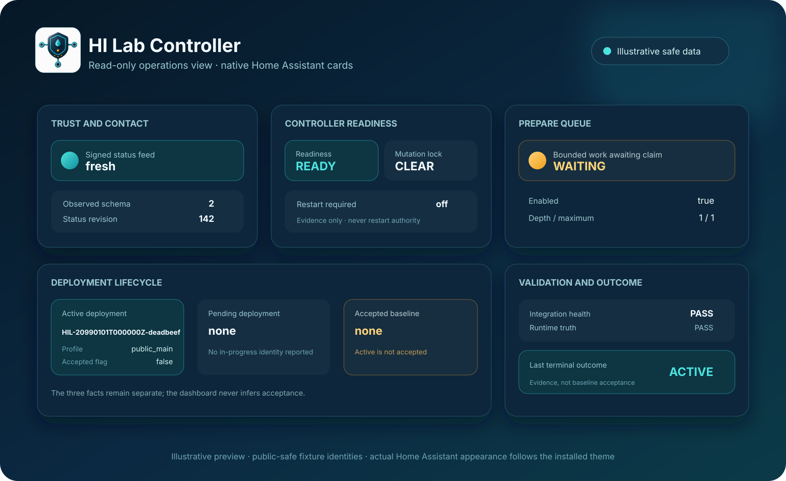

# HI Lab Controller Companion

The public Home Assistant companion for the separately operated **HI Lab Controller**.
It provides a narrow administrator-only action gateway and truthful diagnostic entities
for a dedicated HA Lab. It does not contain the external controller and does not install
or control Humidity Intelligence by itself.

> **Scope:** This is standalone maintainer-facing HA Lab tooling. It is not the
> Humidity Intelligence integration, a required HI dependency, or an HI publication
> and release channel.

The external controller remains private while its design characteristics, security
boundary, compatibility, and operational stability are completed. It is intended to
become a separately published maintainer tool only after those release gates pass.

## Install with custom HACS

1. In HACS, open **Custom repositories**.
2. Add `https://github.com/senyo888/hi-lab-controller-companion` as an
   **Integration** repository.
3. Download the selected published release.
4. Restart Home Assistant when separately approved so the new Python generation can
   become active.
5. Add **HI Lab Controller** from **Settings → Devices & services** and provide the
   private shared secret provisioned for the external controller.

Automatic HACS updates are supported. Only maintainer-published releases are exposed
as normal update candidates; the default branch is hidden. Downloading an update does
not prove restart completion, compatibility, runtime health, deployment acceptance, or
any Humidity Intelligence release state.

For prerequisites, activation, verification, entity meanings, action workflows,
updates, and rollback, see [Using the companion](docs/USING_THE_COMPANION.md).

## How it fits together

The companion supplies the native Home Assistant configuration flow, entities,
actions, and operation notifications. It also includes an optional read-only operations
dashboard at [`dashboards/hi-lab-operations.yaml`](dashboards/hi-lab-operations.yaml).
The dashboard uses only built-in Home Assistant cards and the eleven native companion
entities. It does not call an action, reconstruct controller decisions, or create
another control path. Public-facing validation names describe **Integration health**
and **Runtime truth**; the underlying Stage B and Stage 3 attribute identities remain
unchanged for compatibility.

## Optional operations dashboard

The responsive **Operations** view gives feed integrity, readiness, deployment
lifecycle, lock, baseline, validation, outcome, queue, and restart truth a calm
maintainer-facing hierarchy. A separate **Evidence** view keeps exact attributes close
without overwhelming the operational glance. The dashboard maps explicit controller
state values to presentational colours; the displayed raw state remains authoritative.
Green marks an expected or clear state for that tile, amber flags attention, and red
marks blocked, invalid, stale, degraded, or unavailable truth. Cyan, teal, and
blue-grey identity, timestamp, and disabled-state tiles are neutral evidence—not
healthy verdicts. Active deployment, pending deployment, and accepted baseline remain
separate facts, and unavailable state never appears healthy.

The two view names become native Home Assistant tabs: **Operations** keeps the calm
at-a-glance hierarchy, while **Evidence** exposes the selected exact attributes that
would otherwise crowd it. One small **Open Actions tool** button navigates an
administrator to Home Assistant's own action tool. It cannot prefill or execute an
action and does not weaken the companion's controller-authority boundary.

Import the raw YAML as a new dashboard after the integration has registered
its entities. Home Assistant may assign different entity IDs after an operator rename;
in that case, replace the documented defaults with the matching eleven registered
entities. Full import, compatibility, verification, and removal instructions are in
[Using the companion](docs/USING_THE_COMPANION.md#install-the-optional-read-only-dashboard),
with a compact index in the [optional dashboard gallery](dashboards/README.md).

## Fixed actions

- `hi_lab_controller.prepare_version`
- `hi_lab_controller.activate_prepared_version`
- `hi_lab_controller.discard_prepared_version`
- `hi_lab_controller.deployment_status`
- `hi_lab_controller.controller_health`
- `hi_lab_controller.rollback_deployment`
- `hi_lab_controller.queue_prepare_version`
- `hi_lab_controller.cancel_queued_prepare`

Action registration does not grant authority to use an action. Source and target
selection remain fixed in the external controller, and queue capability remains
controller-owned and fail-closed when disabled.

## Status surface

The integration registers ten sensors and one binary sensor. It accepts signed status
schema majors 1 and 2 and makes controller truth unavailable when the local snapshot is
missing, stale, malformed, unsigned, permission-unsafe, or incompatible.

The eleven entities cover feed health, last contact, controller readiness, active and
pending deployment, mutation lock, accepted baseline, last validation, last outcome,
prepare queue, and restart requirement. Their states and attributes are explained in
[Using the companion](docs/USING_THE_COMPANION.md#the-eleven-entities).

## Boundaries

- No Git, SSH, repository, provider, package, target, HACS, or release authority is
  present in the companion.
- No private addresses, entity IDs, credentials, target identities, or runtime evidence
  belong in this repository.
- This project is separate from the public Humidity Intelligence integration.
- The external controller's future-public direction is not a present availability,
  readiness, publication, or release claim.
- HACS owns normal companion installation and updates. The external controller's
  transactional bootstrap is a separately governed recovery route only.

See [ARCHITECTURE.md](ARCHITECTURE.md) and [SECURITY.md](SECURITY.md).

## Licence

The companion is released under the [MIT License](LICENSE).
